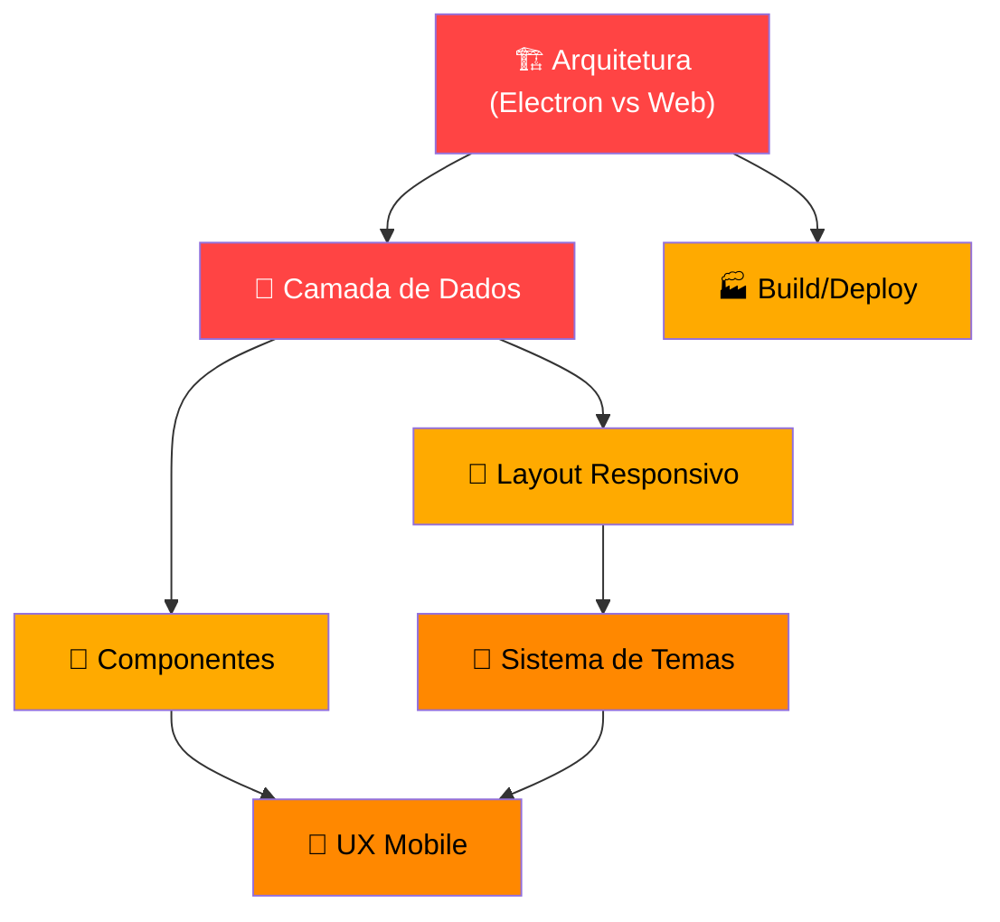

# Requiem — Análise de Desafios: Mobile + Desktop

## Visão Geral do Estado Atual

O Requiem é um app **Electron** puro (React + Vite + TypeScript + Tailwind v4) para gerenciamento de campanhas de RPG. Hoje ele:

- Roda **exclusivamente como app desktop** via Electron
- Usa **better-sqlite3** (nativo do Node.js) para persistência via banco SQLite local
- Comunica UI ↔ dados via **IPC do Electron** (`ipcMain.handle` / `ipcRenderer.invoke`)
- Tem 3 temas visuais complexos (Medieval, Cyberpunk, Vampire) com layouts, intros e CSS dedicados
- Usa **ReactQuill** como editor rich-text para journal entries
- Suporta import/export de banco via `dialog` nativo do Electron

---

## 🏗️ Desafio 1: Arquitetura — Electron vs Web

> **Severidade: 🔴 Crítica — Este é o desafio central de toda a migração**

### O Problema

O projeto inteiro depende do runtime do Electron. Cada chamada de dados passa pelo bridge `window.api` → IPC → Node.js → SQLite. Isso **simplesmente não existe** num navegador mobile.

### O que precisa mudar

| Camada | Hoje (Electron) | Mobile/Web |
|---|---|---|
| **Runtime** | Electron (Chromium + Node) | Navegador puro (Chrome, Safari) |
| **Banco de dados** | `better-sqlite3` (nativo C++) | IndexedDB, sql.js (WASM), ou **backend remoto** |
| **Comunicação** | `ipcRenderer.invoke()` | API REST/GraphQL ou acesso direto ao banco client-side |
| **File system** | `fs` do Node.js | Sem acesso (salvo File System Access API limitada) |
| **Diálogos nativos** | `dialog.showSaveDialog()` | `<input type="file">` / download programático |

### Decisão Necessária

```
┌─────────────────────────────────────────────────────────┐
│  Qual estratégia de distribuição mobile?                │
│                                                         │
│  A) PWA (Progressive Web App)                           │
│     → Roda no browser, offline via Service Worker       │
│     → Dados no IndexedDB ou sql.js (WASM SQLite)       │
│     → Sem loja de apps, instala pelo browser            │
│                                                         │
│  B) App híbrido (Capacitor/Tauri Mobile)                │
│     → Empacota como app nativo iOS/Android              │
│     → Acesso a APIs nativas                             │
│     → Exige publicação nas lojas                        │
│                                                         │
│  C) Web app + Backend                                   │
│     → Frontend web responsivo                           │
│     → Backend Node.js com SQLite/PostgreSQL              │
│     → Sincronização entre dispositivos                  │
│     → Requer servidor/hospedagem                        │
└─────────────────────────────────────────────────────────┘
```

> [!IMPORTANT]
> A escolha entre A, B ou C impacta **tudo**: a camada de dados, o build, o deploy, a sincronização e o custo operacional. Precisamos decidir isso primeiro.

---

## 💾 Desafio 2: Camada de Dados

> **Severidade: 🔴 Crítica**

### O Problema

Toda a comunicação de dados hoje é via `window.api.*`, que é injetado pelo `preload.ts` do Electron:

```typescript
// preload.ts — Isto só existe no Electron
contextBridge.exposeInMainWorld('api', {
  getCampaigns: () => ipcRenderer.invoke('get-campaigns'),
  createCharacter: (data) => ipcRenderer.invoke('create-character', data),
  // ... 20+ métodos
});
```

Os hooks (`useCampaigns`, `useEntities`) e o `App.tsx` fazem chamadas diretas a `(window as any).api.*` em **mais de 20 pontos** do código.

### O que precisa mudar

1. **Criar uma camada de abstração de dados** (Data Access Layer) que funcione nos dois contextos:
   - No Electron: continua usando IPC → SQLite
   - No Web/Mobile: usa IndexedDB, sql.js, ou chamadas HTTP a um backend

2. **Refatorar todos os hooks** para usar essa abstração ao invés de `window.api` diretamente

3. **Migrar o esquema do banco** — se usar IndexedDB, a estrutura é diferente de SQL

```
Antes:  Component → window.api.xxx() → IPC → Node → SQLite
Depois: Component → DataService.xxx() → [Electron: IPC | Web: IndexedDB/HTTP]
```

### Funcionalidades que precisam de atenção especial

- **Export/Import de banco** — usa `dialog.showSaveDialog()` e `fs.copyFileSync()`. No mobile/web, isso precisa ser refeito com download/upload de arquivos
- **Imagens de personagens** — hoje são armazenadas como **base64 Data URLs** direto no SQLite. Isso pode causar problemas de performance em bancos client-side

---

## 📐 Desafio 3: Layout e UI Responsivo

> **Severidade: 🟡 Alta**

### O Problema

O layout atual foi desenhado para uma janela de **1200x800px mínimo**. Vários padrões de layout vão quebrar em telas de 360-414px de largura.

### Problemas específicos por componente

#### App.tsx — Header do Dashboard (linhas 351-454)
- Os headers temáticos (Medieval, Cyberpunk, Vampire) têm **larguras fixas**, decorações absolutamente posicionadas, e texto grande (`text-4xl`, `text-5xl`)
- O header cyberpunk tem elementos decorativos como barras de EEG e status monitors que não cabem em mobile

#### App.tsx — Grid de Campanhas (linha 542)
```tsx
<div className="grid grid-cols-1 md:grid-cols-2 gap-8 md:gap-x-24 md:gap-y-12">
```
- O grid já tem `grid-cols-1` para mobile ✅, mas os cards têm `h-48` fixo e padding abundante que pode ficar apertado

#### App.tsx — Header interno da campanha (linhas 698-715)
```tsx
<header className="px-8 py-4 border-b ...">
  <div className="flex items-center space-x-6">
    <button>...<ArrowLeft/> Dashboard</button>  // flex horizontal
    <h2 className="text-2xl">☽☉☾ Campaign Name</h2>
  </div>
</header>
```
- Layout horizontal com `space-x-6` não cabe em mobile
- Título + botão de voltar + info de gênero/sistema — tudo na mesma linha

#### Abas (Tabs) — linhas 718-740
- As tabs `Characters | Locations | Journal` são horizontal com ícones + texto
- Em mobile, precisam virar tabs compactas (só ícone) ou bottom navigation

#### EntryModal — Sidebar de referências
```tsx
<div className="w-80 bg-surface-card flex flex-col overflow-hidden">
```
- A sidebar de 320px **fixa** + o editor = requer ~900px mínimo
- Em mobile, a sidebar precisa virar um **drawer** ou painel colapsável

### Layouts temáticos que precisam ser repensados

| Tema | Componente Problemático | Motivo |
|---|---|---|
| Medieval | `MedievalLayout.tsx` | O "livro" com spine central, capa de couro e clasp decorativo de 112px não funciona em tela estreita |
| Cyberpunk | `CyberpunkLayout.tsx` | Top bar de 96px com clasp central + corner decorations + scanlines overlay |
| Vampire | `VampireLayout.tsx` | Similar aos outros, decorações absolutas assumindo largura ampla |

---

## 🧩 Desafio 4: Componentes Específicos

> **Severidade: 🟡 Alta**

### CharacterModal — Grid de formulário
```tsx
<div className="grid grid-cols-2 gap-4">
  <InputField label="Name *" />
  <InputField label="Race" />
  // ... 6 campos em grid 2-col
</div>
```
- Em mobile, precisa ser `grid-cols-1`
- O upload de imagem com `<input type="file">` funciona em mobile mas a UX precisa de ajuste

### EntryModal — ReactQuill Editor
- O ReactQuill com toolbar completa ocupa muito espaço em mobile
- O **menu de contexto** (right-click para "Link Text") **não funciona em touch** — precisa de alternativa (long press ou botão na toolbar)
- A toolbar `[header, bold, italic, underline, strike, blockquote, list, link, makeLink, clean]` pode precisar de scroll horizontal ou agrupamento em mobile

### CharacterList / LocationList — Cards Grid
```tsx
<div className="grid grid-cols-1 md:grid-cols-2 lg:grid-cols-3 gap-6">
```
- Grid já é responsivo ✅, mas os cards com imagens `h-48` e hover effects (scale, translate) precisam de adaptação para touch

### DatabaseControls
- Export/Import usa diálogos nativos do Electron que não existem em browsers

### ThemeSwitcher
- Posição fixa precisa ser verificada em mobile (não sobrepor conteúdo)

---

## 🎨 Desafio 5: Sistema de Temas

> **Severidade: 🟠 Média**

### O Problema

Os 3 temas foram desenhados com **estética desktop-first**:

- **Medieval**: Livro com spine central, moldura de couro, clasp metálico — conceitos visuais que assumem tela wide
- **Cyberpunk**: Scanlines CRT, terminal aesthetic, corner frames, grid pattern — os decoradores tomam espaço fixo
- **Vampire**: Atmosfera escura com noise overlays — mais adaptável, mas headers ainda são desktop-sized

### CSS dos temas

| Tema | CSS | Complexidade |
|---|---|---|
| Medieval | `medieval.css` (4.2KB) | Wood plank textures, serifed typography, corner decorations |
| Cyberpunk | `cyberpunk.css` (10.3KB) | Glitch effects, neon glows, circuit patterns, CRT scanlines, animations |
| Vampire | `vampire.css` (20.4KB) | Noise overlays, blood effects, gothic typography |

Os temas usam valores fixos em pixels, animações pesadas (que consomem bateria em mobile) e overlays full-screen que precisam de media queries.

---

## 📱 Desafio 6: Experiência Mobile-First

> **Severidade: 🟠 Média**

### Interações que precisam de adaptação

| Interação Desktop | Equivalente Mobile |
|---|---|
| Hover para revelar botões (edit/delete em cards) | Sempre visíveis, ou swipe-to-reveal, ou long-press menu |
| Right-click para menu de contexto no editor | Long-press ou botão dedicado na toolbar |
| Scroll fino (8px scrollbar customizada) | Touch scroll nativo |
| `cursor-pointer` feedback | Touch feedback (ripple, scale) |
| Modais ocupando 90vh | Modais full-screen ou bottom sheets |
| Sidebar fixa de 320px no EntryModal | Drawer/panel colapsável |

### Performance em mobile

- Animações CSS pesadas (glitch, neon pulse, CRT scanlines) **consomem bateria**
- Base64 de imagens no banco pode causar lentidão no carregamento
- ReactQuill pode ter performance issues em mobile

### Touch targets

- Vários botões usam `p-1.5` (12px padding) → O mínimo recomendado para mobile é **44x44px** (Apple) ou **48x48px** (Material)
- Botões de delete/edit nos cards são muito pequenos para toque

---

## 🏭 Desafio 7: Build e Deploy

> **Severidade: 🟡 Alta (mas depende da decisão do Desafio 1)**

### Cenário atual
```json
{
  "build": "npm run build:vite && npm run build:electron && electron-builder"
}
```

### O que precisaria mudar

Para suportar ambas as plataformas, precisaríamos de:

1. **Build condicional** — detectar se está buildando para Electron ou Web
2. **Variáveis de ambiente** — `VITE_PLATFORM=electron` vs `VITE_PLATFORM=web`
3. **Treeshaking** — não incluir código do Electron no bundle web
4. **Novos scripts**:
   ```json
   {
     "dev:desktop": "...",       // Electron dev
     "dev:web": "...",           // Vite dev (sem Electron)
     "build:desktop": "...",     // Electron build
     "build:web": "...",         // Web/PWA build
   }
   ```

---

## 📋 Resumo: Mapa de Impacto



## 🔢 Ordem de Ataque Sugerida

| Fase | Desafio | Descrição |
|---|---|---|
| **1** | Arquitetura | Decidir PWA vs Híbrido vs Backend. Tudo depende disso. |
| **2** | Camada de Dados | Criar `DataService` abstrato + implementação por plataforma |
| **3** | Build/Deploy | Configurar builds separados (desktop vs web) |
| **4** | Layout Responsivo | Adaptar App.tsx, headers, tabs, grids |
| **5** | Componentes | Refatorar modais, editor, listas para mobile |
| **6** | Temas | Adaptar os 3 temas para telas menores |
| **7** | UX Mobile | Substituir hover, right-click, touch targets, performance |

---

> [!IMPORTANT]
> **Próximo passo:** Preciso da sua decisão sobre o **Desafio 1 (Arquitetura)**. Qual das 3 abordagens faz mais sentido pro Requiem?
> - **(A) PWA** — Tudo no browser, dados locais, sem servidor
> - **(B) App híbrido (Capacitor)** — App nativo com webview, acesso a APIs nativas
> - **(C) Web + Backend** — Servidor centralizado, sincronização entre dispositivos
> 
> Minha recomendação pessoal seria **A (PWA com sql.js/IndexedDB)** por ser a rota mais leve, manter o Electron existente intacto, e não exigir servidor. Mas depende dos seus objetivos (precisa de sync entre devices? Precisa estar na Play Store?).
