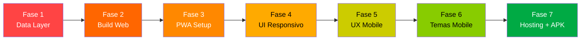

# Requiem PWA — Plano de Implementação para Mobile (APK)

O objetivo é transformar o Requiem em uma PWA funcional que possa ser empacotada como APK via Bubblewrap/PWABuilder, mantendo o app Electron desktop existente intacto.

## Pipeline Completo: De Electron-only até APK



---

## Fase 1 — Camada de Dados Abstrata

> **Pré-requisito para tudo. Sem isso, nada funciona fora do Electron.**

### Objetivo
Criar um `DataService` que abstraia o acesso a dados. No Electron, continua usando IPC. No browser/PWA, usa **sql.js (SQLite compilado para WASM)** + **IndexedDB** para persistência.

### Arquivos

#### [NEW] `src/shared/dataService.ts`
Interface abstrata com todos os métodos de dados:
```typescript
export interface IDataService {
  // Campaigns
  getCampaigns(): Promise<Campaign[]>;
  getCampaign(id: number): Promise<Campaign>;
  createCampaign(data: Omit<Campaign, 'id'>): Promise<number>;
  updateCampaign(id: number, data: Partial<Campaign>): Promise<boolean>;
  deleteCampaign(id: number): Promise<boolean>;
  // Characters, Locations, Entries — mesma estrutura
  // ...
  // Backups
  exportDatabase(): Promise<Uint8Array | boolean>;
  importDatabase(data: Uint8Array): Promise<boolean>;
}
```

#### [NEW] `src/renderer/services/electronDataService.ts`
Implementação que usa `window.api.*` (o que já existe hoje). Wrapper fino.

#### [NEW] `src/renderer/services/webDataService.ts`
Implementação que usa **sql.js** (WASM SQLite no browser):
- Carrega o WASM do sql.js
- Cria/carrega o banco SQLite na memória
- Persiste o binário do banco no **IndexedDB** usando a lib `idb`
- Roda as mesmas queries SQL que o `database.ts` do Electron
- Export = `db.export()` → download de arquivo
- Import = upload de arquivo → carrega no sql.js → salva no IndexedDB

#### [NEW] `src/renderer/services/index.ts`
Factory que detecta o ambiente e retorna o serviço correto:
```typescript
export function createDataService(): IDataService {
  if (typeof window !== 'undefined' && (window as any).api) {
    return new ElectronDataService();
  }
  return new WebDataService();
}
```

#### [MODIFY] `src/renderer/hooks/useCampaigns.ts`
Substituir todas as chamadas `(window as any).api.*` por `dataService.*`

#### [MODIFY] `src/renderer/hooks/useEntities.ts`
Idem

#### [MODIFY] `src/renderer/App.tsx`
Substituir as ~15 chamadas diretas a `(window as any).api.*` por `dataService.*`

#### [MODIFY] `src/renderer/components/DatabaseControls.tsx`
Adaptar export/import para funcionar via `DataService` (download/upload de arquivo no web)

### Dependências novas
```
sql.js     — SQLite compilado para WASM
idb        — Wrapper leve para IndexedDB
```

---

## Fase 2 — Build Web Separado

### Objetivo
Configurar o Vite para produzir um build web puro (sem Electron), mantendo o build desktop existente.

#### [NEW] `vite.config.web.ts`
Config Vite dedicada para o build web:
- Sem referências ao Electron
- Output para `dist/web/`
- Define `VITE_PLATFORM=web` para treeshaking
- Copia o WASM do sql.js para o diretório público

#### [MODIFY] `package.json`
Adicionar novos scripts:
```json
{
  "dev:web": "vite --config vite.config.web.ts",
  "build:web": "vite build --config vite.config.web.ts",
  "preview:web": "vite preview --config vite.config.web.ts"
}
```

#### [MODIFY] `tsconfig.json`
Adicionar tipos do `vite-plugin-pwa`

### Verificação
- `npm run dev:web` deve abrir o app no browser sem erros
- Todas as operações CRUD devem funcionar via sql.js/IndexedDB

---

## Fase 3 — Configuração PWA

### Objetivo
Transformar o build web num PWA instalável com offline support.

#### [MODIFY] `vite.config.web.ts`
Adicionar o plugin `vite-plugin-pwa`:
```typescript
import { VitePWA } from 'vite-plugin-pwa';

VitePWA({
  registerType: 'autoUpdate',
  workbox: {
    globPatterns: ['**/*.{js,css,html,ico,png,svg,wasm}'],
  },
  manifest: {
    name: 'Requiem — RPG Campaign Manager',
    short_name: 'Requiem',
    description: 'Manage your tabletop RPG campaigns',
    theme_color: '#0a0a0f',
    background_color: '#0a0a0f',
    display: 'standalone',
    orientation: 'portrait',
    icons: [
      { src: 'pwa-192x192.png', sizes: '192x192', type: 'image/png' },
      { src: 'pwa-512x512.png', sizes: '512x512', type: 'image/png' },
      { src: 'pwa-512x512.png', sizes: '512x512', type: 'image/png', purpose: 'maskable' },
    ],
  },
})
```

#### [NEW] `src/renderer/public/pwa-192x192.png`
#### [NEW] `src/renderer/public/pwa-512x512.png`
Ícones do Requiem para PWA (gerar a partir do ícone existente em `src/build/`)

### Dependência nova
```
vite-plugin-pwa  — Gera Service Worker + Manifest automaticamente
```

### Verificação
- Build web deve gerar `manifest.webmanifest` e `sw.js`
- App deve ser instalável no Chrome mobile ("Add to Home Screen")
- App deve funcionar offline após primeiro carregamento

---

## Fase 4 — Layout Responsivo

### Objetivo
Fazer todos os layouts funcionarem em telas de 360px a 1920px.

#### [MODIFY] `src/renderer/App.tsx`

**Dashboard header (linhas 351-454):**
- Reduzir títulos para `text-2xl` em mobile (`text-2xl md:text-4xl`)
- Esconder elementos decorativos do Cyberpunk em telas pequenas (`hidden sm:flex`)
- Compactar ornamentos do Medieval e Vampire

**Campaign header interno (linhas 698-715):**
- Stack vertical em mobile: botão voltar em cima, nome da campanha embaixo
- `flex-col sm:flex-row`

**Tabs (linhas 718-740):**
- Em mobile: mostrar só ícones, sem texto (`<span className="hidden sm:inline">`)
- Alternativa: transformar em bottom navigation fixa

**Grid de campanhas (linha 542):**
- Já responsivo ✅, ajustar padding (`p-4 md:p-8`)

#### [MODIFY] `src/renderer/components/modals/EntryModal.tsx`

**Sidebar de referências (w-80):**
- Em mobile: esconder sidebar por padrão, botão toggle para mostrar como drawer
- `hidden lg:flex` + botão para abrir como overlay em mobile

**Modal container:**
- Em mobile: ocupar tela inteira (`max-w-6xl lg:max-w-6xl max-w-full`)
- `h-[90vh]` → `h-screen lg:h-[90vh]`

#### [MODIFY] `src/renderer/components/modals/CharacterModal.tsx`
- Grid `grid-cols-2` → `grid-cols-1 sm:grid-cols-2`
- Modal width: full-screen em mobile

#### [MODIFY] `src/renderer/components/modals/LocationModal.tsx`
- Mesma adaptação do CharacterModal

#### [MODIFY] `src/renderer/components/characters/CharacterList.tsx`
- Grid já responsivo ✅
- Ajustar touch targets dos botões edit/delete

#### [MODIFY] `src/renderer/components/locations/LocationList.tsx`
- Idem

#### [MODIFY] `src/renderer/components/journal/JournalList.tsx`
- Idem

---

## Fase 5 — UX Mobile (Touch + Interações)

### Objetivo
Adaptar todas as interações desktop-only para funcionar em touch.

#### [MODIFY] Botões de ação nos cards (CharacterList, LocationList, JournalList)
- **Hoje:** `opacity-0 group-hover:opacity-100` (invisíveis até hover)
- **Mobile:** Sempre visíveis em mobile (`opacity-100 sm:opacity-0 sm:group-hover:opacity-100`)
- Aumentar touch targets: mínimo `p-2` (→ ~40px)

#### [MODIFY] `src/renderer/components/modals/EntryModal.tsx`
- **Right-click menu:** Não funciona em touch
- Adicionar botão explícito na toolbar do ReactQuill para "Link Text" (já existe o `makeLink`, mas precisa estar mais visível)
- Considerar substituir ReactQuill por **TipTap** (mais mobile-friendly, headless, melhor com touch) — mas isso é opcional e pode ser feito depois

#### [MODIFY] `src/renderer/components/DatabaseControls.tsx`
- Export: em vez de `dialog.showSaveDialog()`, fazer download programático do arquivo
- Import: usar `<input type="file">` padrão

#### [MODIFY] `src/renderer/components/ThemeSwitcher.tsx`
- Verificar posição fixa não sobrepõe conteúdo em mobile
- Possivelmente mover para dentro de um menu/drawer

#### [NEW/MODIFY] CSS global
- Adicionar `touch-action: manipulation` para eliminar delay de 300ms
- Adicionar `-webkit-tap-highlight-color: transparent` para feedback visual limpo
- Garantir `font-size: 16px` nos inputs (evita zoom automático no iOS)

---

## Fase 6 — Temas Adaptados para Mobile

### Objetivo
Os 3 temas devem ter uma experiência mobile digna, mesmo que simplificada.

#### [MODIFY] `src/renderer/themes/medieval/MedievalLayout.tsx`
- **Hoje:** Livro com spine central, moldura de couro, clasp de 112px
- **Mobile:** Simplificar — remover spine central, reduzir clasp, margins menores
- Usar media queries: `hidden md:block` para elementos decorativos pesados

#### [MODIFY] `src/renderer/themes/cyberpunk/CyberpunkLayout.tsx`
- **Hoje:** Top bar de 96px, corner frames, scanlines overlay
- **Mobile:** Reduzir top bar, esconder corners, manter scanlines (leves)
- Título REQUIEM: `text-2xl md:text-5xl`

#### [MODIFY] `src/renderer/themes/vampire/VampireLayout.tsx`
- Similar — reduzir decorações em mobile

#### [MODIFY] CSS dos temas
- `medieval.css`: Adicionar `@media (max-width: 640px)` para wood-plank e corner ornaments
- `cyberpunk.css`: Reduzir/desabilitar animações pesadas em mobile (`prefers-reduced-motion`)
- `vampire.css`: Simplificar noise overlays em mobile (performance/bateria)

---

## Fase 7 — Hosting + Geração do APK

### Objetivo
Hospedar a PWA e gerar o APK via Bubblewrap ou PWABuilder.

### Passos

#### 7.1 — Hosting
A PWA precisa estar hospedada com **HTTPS** para funcionar como TWA.

Opções gratuitas/baratas:
| Serviço | Custo | HTTPS | Deploy |
|---|---|---|---|
| **Vercel** | Grátis | ✅ Auto | `vercel --prod` |
| **Netlify** | Grátis | ✅ Auto | Drag & drop ou CLI |
| **GitHub Pages** | Grátis | ✅ Auto | GitHub Actions |
| **Cloudflare Pages** | Grátis | ✅ Auto | Git integration |

> [!TIP]
> Recomendo **Vercel** ou **Netlify** pela simplicidade. Basta apontar para a pasta `dist/web/` do build.

#### 7.2 — Validação PWA
Antes de gerar o APK:
1. Rodar **Lighthouse** no Chrome DevTools → verificar score PWA
2. Confirmar que o manifest está correto
3. Confirmar que o Service Worker está registrado
4. Testar "Install App" no Chrome mobile

#### 7.3 — Geração do APK

**Opção A: PWABuilder (mais fácil)**
1. Ir a [pwabuilder.com](https://www.pwabuilder.com/)
2. Inserir a URL da PWA hospedada
3. Customizar nome, ícones, cores
4. Fazer download do `.apk` e `.aab`

**Opção B: Bubblewrap CLI (mais controle)**
```bash
npm install -g @bubblewrap/cli
bubblewrap init --manifest https://seu-dominio.com/manifest.webmanifest
bubblewrap build
# Gera: app-release-signed.apk e app-release-bundle.aab
```

#### 7.4 — Digital Asset Links
Para que o APK rode em fullscreen (sem barra de URL):
1. Gerar o SHA-256 fingerprint do certificado de assinatura
2. Hospedar `/.well-known/assetlinks.json` no seu domínio
3. Validar com o [Google Statement List Generator](https://digitalassetlinks.withgoogle.com/)

---

## Resumo das Dependências Novas

| Pacote | Propósito | Fase |
|---|---|---|
| `sql.js` | SQLite compilado para WASM (banco no browser) | 1 |
| `idb` | Wrapper leve para IndexedDB (persistir o banco) | 1 |
| `vite-plugin-pwa` | Gera Service Worker + Web Manifest | 3 |
| `@bubblewrap/cli` | Empacota PWA como APK (global, dev only) | 7 |

---

## Ordem de Execução e Estimativa

| Fase | Descrição | Arquivos impactados | Complexidade |
|---|---|---|---|
| **1** | Data Layer abstrato | ~8 arquivos (novos + modificados) | 🔴 Alta |
| **2** | Build Web separado | 3 arquivos (config) | 🟢 Baixa |
| **3** | PWA Setup | 3-4 arquivos (config + ícones) | 🟢 Baixa |
| **4** | Layout Responsivo | ~8 componentes | 🟡 Média |
| **5** | UX Mobile | ~6 componentes | 🟡 Média |
| **6** | Temas Mobile | 6 arquivos (3 layouts + 3 CSS) | 🟡 Média |
| **7** | Hosting + APK | Configuração externa | 🟢 Baixa |

---

## User Review Required

> [!IMPORTANT]
> **Hosting:** Você tem preferência entre Vercel, Netlify, GitHub Pages ou outro? Isso impacta a configuração de deploy na Fase 7.

> [!IMPORTANT]
> **ReactQuill:** Quer manter o ReactQuill no mobile (funciona, mas UX não é ideal) ou migrar para o **TipTap** (melhor mobile, mas requer reescrever o editor)? Recomendo manter o ReactQuill por agora e migrar depois se necessário.

> [!IMPORTANT]  
> **Escopo inicial:** Quer que executemos todas as 7 fases de uma vez, ou prefere ir fase por fase, validando cada uma antes de avançar?

## Verification Plan

### Automated Tests
- `npm run dev:web` — app abre no browser sem erros de `window.api`
- CRUD completo funciona no browser (criar/editar/deletar campanha, personagem, local, entry)
- `npm run build:web` — build produz bundle sem erros
- Lighthouse PWA score ≥ 90

### Manual Verification
- Instalar PWA no Chrome Android → funciona offline
- Gerar APK via Bubblewrap → instalar no Android → app abre fullscreen
- Testar todos os 3 temas em tela de 360px de largura
- Testar criação de personagem, journal entry com mentions em mobile
